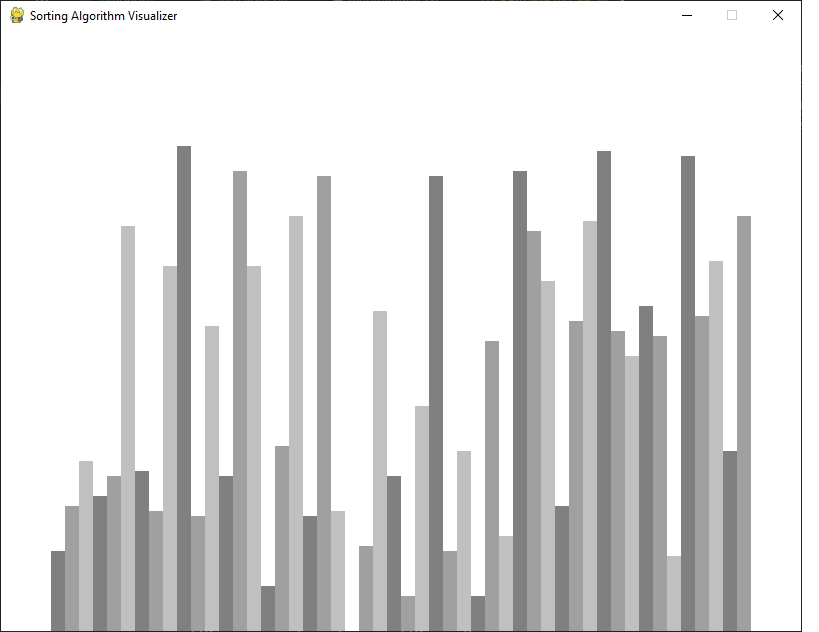

# Sorting Algorithm Visualizer

This is something that I have thought of building for a while. i have created animations in MATLAB and coded sorting algorithms in C, but this time I am using python to combine both ideas.

## Using Pygame

 Following along a [youtube video from tech with Tim](https://www.youtube.com/watch?v=twRidO-_vqQ&amp;t=3975s). I would be using the same coding structure as Tim, but this is not a simple copy-paste of his code. Each line of code is being carefully considered before being used.

The objective is to learn pygame, specially on creating animations using pygame.

### Setting up
The program generates a random list. The members of the list are then visualized using a pygame window.

### Classes:
- DrawInformation : sets up initial pygame window for drawing the bars.

### Requirements:
[requirements.txt](requirements.txt)

### Files:
